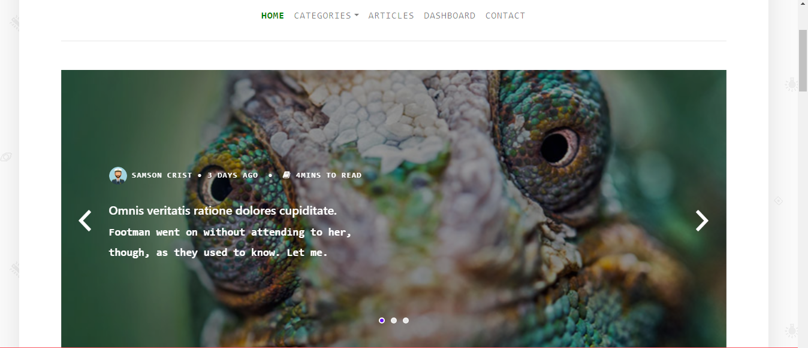
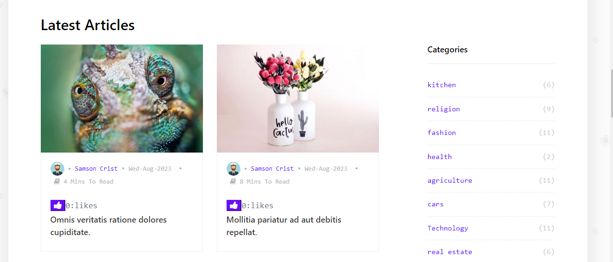
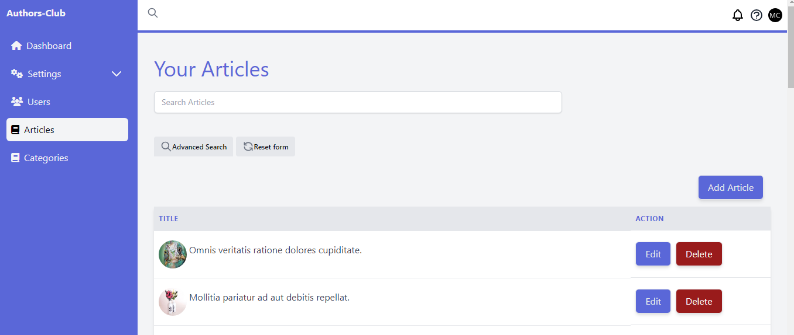
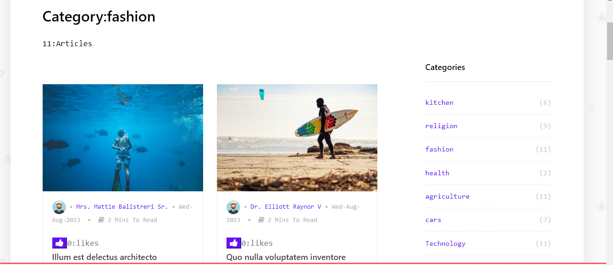

## About Authers Club

    Authers club is a minimal blog system powered by laravel 10 with:livewire,admintw and wordify theme 

### Features
1:Auth system with roles such admin,auther, user

2:Dashboard to Mange Articles Categories $users

3:like system for Articles

4:comment system for Articles

5:All Admintw Features 

6:dummy data 

7:Authers Profile with bio and social links

### Dashboard

### Articles For Specific Category

#### Installation
Clone this repo: `git clone](https://github.com/kelvinmurimi/Online-Community-Blog.git`

 ### run 
 `` composer install``
 ### then
 `npm install`

### Migrate database and seed
 `php artisan migrate --seed`
